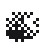
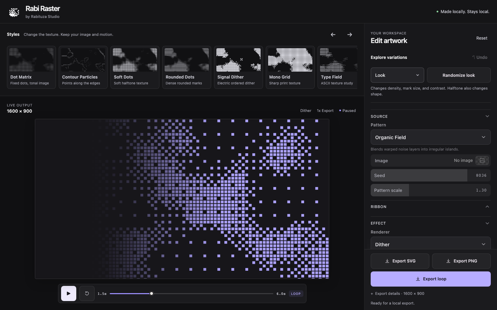

# Rabi Raster

<picture>
  <source media="(prefers-color-scheme: dark)" srcset="public/brand/mark.svg">
  
</picture>

*Turn photos and generated patterns into raster artwork, static graphics, and seamless loops. Everything happens in your browser.*



Rabi Raster is a local-first creative editor by Rabituza Studio. It gives designers a quick way to explore halftone, dither, ASCII, dot matrix, and contour-based treatments without sending source images to a server. Use it for portfolio backgrounds, cover art, still overlays, and looping website assets.

New sessions and Reset start with Organic Field and Signal Dither. Existing saved browser settings are restored when available.

The editor keeps source, effect, motion, palette, and output controls independent. You can change a style or generate a focused variation without replacing your photo or resetting the rest of the composition.

## What it can do

- Start with a local image or a generated field: Waves, Ring, Noise, Contours, Orbits, Interference, Ribbon, or Organic Field.
- Render the source as Halftone, Dither, ASCII, Dot Matrix, or Contour Particles.
- Apply ready-made styles while preserving the source, palette, motion, and export settings.
- Randomize one target at a time: Look, Motion, Pattern, Points, or Accents. Undo restores recent variations.
- Add repeatable motion with Wave, Drift, Pulse, or Scatter & return.
- Reserve clear space for text on the left or right of a composition.
- Export a static SVG or PNG, or a WebM or MP4 loop.
- Save settings as JSON and load them later.

## Quick start

Requires Node.js 22.12 or newer and npm.

The GitHub repository is currently private. You need access to `matikkutik/rabi-raster` and authenticated Git credentials before cloning it.

```sh
git clone https://github.com/matikkutik/rabi-raster.git
cd rabi-raster
npm ci
npm run dev
```

Open [http://127.0.0.1:5199](http://127.0.0.1:5199). To check the production build locally:

```sh
npm run build
npm run preview
```

Automated browser verification currently runs in Chromium. Video export availability still depends on the browser, operating system, and available video encoders.

## Generators and renderers

Generators create the underlying image field. Renderers decide how that field becomes visible. Both editor menus include static previews and short descriptions. Compare the larger examples in the [visual guide](docs/gallery/choice-guide.md).

| Generator or source | Good starting point |
| --- | --- |
| Waves, Ring, Contours, Orbits, Interference | Structured geometric compositions |
| Noise | Grainy, irregular fields |
| Ribbon, Organic Field | Flowing forms and seamless motion |
| Image | Photos, logos, illustrations, and custom textures |

| Renderer | Result |
| --- | --- |
| Halftone | Circles, squares, or rounded marks sized by tone |
| Dither | A fixed 4 × 4 Bayer pattern for crisp tonal detail |
| ASCII | A customizable character ramp sampled from the source |
| Dot Matrix | Fixed-size dots controlled by opacity or brightness |
| Contour Particles | Points anchored to detected edges |

Contour Particles detects edges. It does not remove a busy photo background, so a clear silhouette or transparent source gives cleaner results. Imported photos use centered cover cropping to fill the selected composition.

## Export formats

| Format | Motion | Transparency | Notes |
| --- | --- | --- | --- |
| SVG | Static frame | Yes | Editable vector marks. No bitmap or script is embedded. |
| PNG | Static frame | Yes | Best fallback when exact raster output matters. |
| WebM | Loop | Yes | Transparent export requires a VP9 alpha encoder. |
| MP4 | Loop | No | Uses an opaque background in the current editor. |

Turn **Transparent** on for an overlay. SVG and PNG retain transparency directly. Transparent video is available as VP9 WebM when the browser exposes a compatible encoder. MP4 export is disabled while transparency is on.

Transparent WebM playback has been verified in Chromium. Safari has a [reported VP9 alpha issue](https://bugs.webkit.org/show_bug.cgi?id=275908), so keep a transparent PNG fallback and test the real target browser before release.

SVG exports the selected frame only. It does not contain hover behavior. Build interactions around the SVG in the destination website, or use the renderer with saved settings for a live effect. ASCII remains SVG text, so its appearance depends on the monospace fonts available to the viewer. Use PNG when the exact glyph rendering must stay fixed.

See [Using Rabi Raster assets on a website](docs/website-use.md) for loading, fallback, and reduced-motion guidance.

## Three starter recipes

### Photo to graphic dots

1. Open **Source**, set **Pattern** to **Image**, then choose a local photo in **Image**.
2. Start with **Soft Dots** or **Dot Matrix**.
3. Adjust Density, Mark size, Contrast, and Invert.
4. Use **Text space** if the image will sit behind a heading.
5. Export PNG for a fixed image or SVG for editable marks.

### Transparent website loop

1. Open **Source** and set **Pattern** to Ribbon, Organic Field, or another generated pattern.
2. In **Motion**, choose a **Movement** and preview the full loop.
3. In **Output**, set **Transparent** to On and **Video** to WebM.
4. Start with **Quality** set to Web · compact, **Frame rate** set to 24, and **Resolution** set to 1×.
5. Export a matching transparent PNG as the fallback.

### ASCII poster study

1. Open **Source** and choose a generated **Pattern**, or set **Pattern** to **Image** and choose a local photo.
2. Select the **ASCII** renderer or the **Type Field** style.
3. Edit the Glyphs ramp, then tune Density and Contrast.
4. Export PNG when font consistency matters, or SVG when editable text is more useful.

See the [gallery](docs/gallery/README.md) for the editor screenshot and a local interactive transparency example.

## Privacy and saved settings

Image decoding, rendering, and export run locally in the browser. The app has no account, backend, analytics, telemetry, or remote image-processing service. After dependencies are installed, the editor can run without a network connection.

The editor keeps control settings in local browser storage. A downloaded settings JSON contains control values only. It never contains the imported image. If a saved setup uses an image source, keep that image separately and choose it again after loading the JSON.

## Current limits

- Rabi Raster creates two-dimensional artwork. It does not import or render 3D scenes.
- It accepts still images as sources, not source video.
- Exported SVG files are static and do not include hover or scroll interactions.
- ASCII layout can change when a different monospace font is used.
- Transparent video needs browser support for VP9 alpha. MP4 is opaque.
- Large, dense SVG files may be heavier than PNG or WebM and should be measured in the destination page.

## Development and verification

The deterministic effect core lives in `src/raster/`. React and DialKit provide the editor controls, while Mediabunny and WebCodecs handle video encoding. Preview and export use the same normalized loop phase.

Run the normal checks with:

```sh
npm test
npm run build
```

Browser tests run against the Vite editor on port 5199:

```sh
npx playwright install chromium
npm run test:browser
```

The media quality benchmark is separate because it regenerates example artifacts. It is not part of the default test or CI path. Current verification notes and bounded measurements are in [docs/verification.md](docs/verification.md).

See [CONTRIBUTING.md](CONTRIBUTING.md) before preparing a change.

## Credits

Created by Mateusz Kruhlik / Rabituza Studio.

Rabi Raster uses [DialKit](https://www.dialkit.dev/) by Josh Puckett for its editor controls and [Mediabunny](https://mediabunny.dev/) for media containers and browser encoding. Third-party packages retain their own licenses. See [THIRD_PARTY_NOTICES.md](THIRD_PARTY_NOTICES.md).

## License status

A license for the original Rabi Raster project code has not been selected yet. Public open-source release is pending that decision. Do not infer a project license from the licenses of its dependencies.
