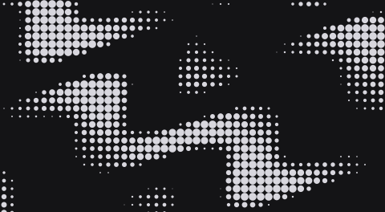
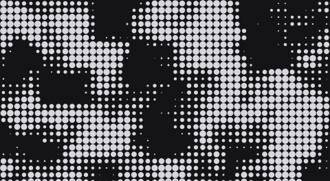
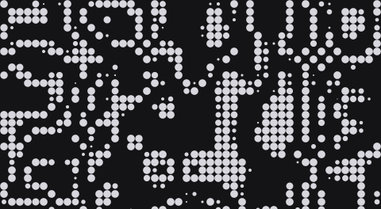
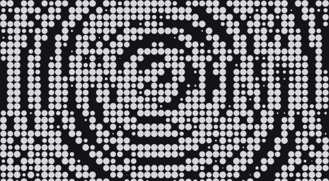
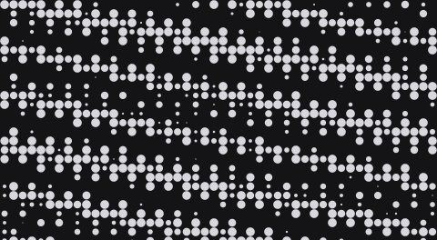
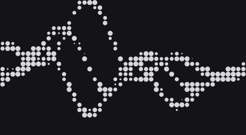
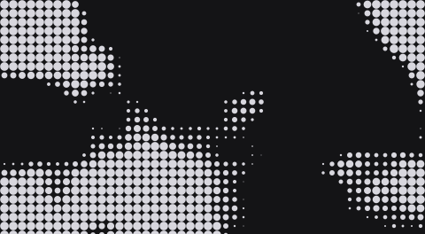
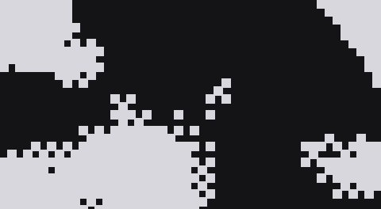
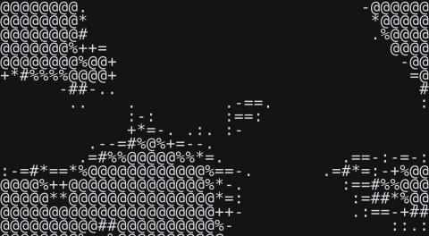
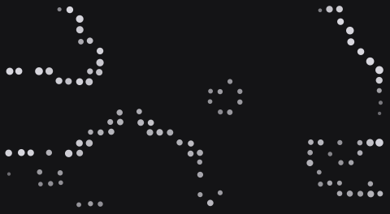

# Pattern and renderer guide

Choose a pattern to create the source, then a renderer to decide how it is drawn. Imported photos can use every renderer too.

These are static frames from the actual renderer. Pattern examples share one drawing treatment; renderer examples share the same generated Organic Field. Motion is off so the differences are easy to compare. No source photograph is used.

## Patterns

| Preview | Choice | What it does |
| --- | --- | --- |
|  | **Waves** | Creates flowing bands from layered waves. |
|  | **Ring** | Builds a textured circular band around a shifted center. |
|  | **Noise** | Blends two noise layers into a soft granular field. |
|  | **Contours** | Turns terrain-like noise into repeated contour bands. |
|  | **Orbits** | Overlaps three ripple fields to create clusters of rings. |
|  | **Interference** | Crosses two wave directions to create a dense moire pattern. |
|  | **Ribbon** | Multiple woven strands cross and exchange position. |
|  | **Organic Field** | Blends warped noise layers into irregular islands. |
| Your local file | Image | Choose a local image; it stays in this browser. |

## Renderers

| Preview | Choice | What it does |
| --- | --- | --- |
|  | **Halftone** | Changes the size of dots and shapes to show light and shade. |
|  | **Dither** | Builds tonal detail from a crisp pattern of square pixels. |
|  | **ASCII** | Turns light and shade into characters from a custom glyph set. |
|  | **Dot Matrix** | Shows tone through a regular grid of brighter or softer dots. |
|  | **Contour Particles** | Traces detected edges with an irregular field of dots. |

## Where to start

- **Website background:** Organic Field or Ribbon, then Dither or Halftone. Reserve text space and use gentle motion.
- **Photo treatment:** Choose Image and compare Halftone with Dot Matrix. Adjust contrast before density.
- **Crisp silhouette:** Try Contour Particles with a clean source; it detects edges rather than removing a background.
- **Typographic artwork:** Choose ASCII and edit the built-in Glyphs ramp if needed.

The editor generates small previews only while a menu is open. This gallery is separate from the editor bundle. To try these choices, [run the editor](../../README.md#quick-start).
